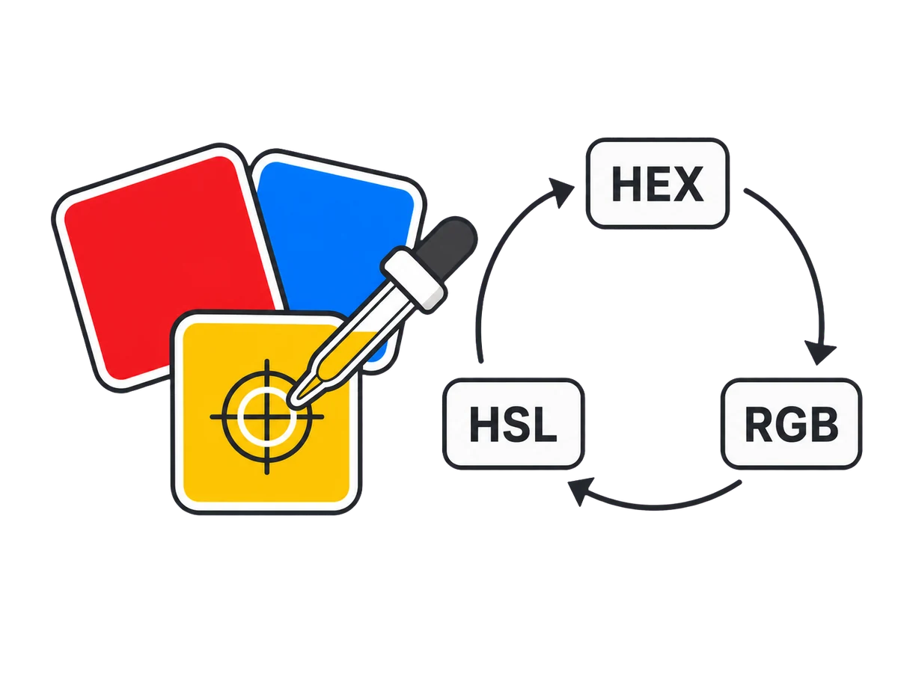

# Color Picker & Converter

Pick, convert, compare, and export colors with synchronized HEX, RGB, HSL, HSV, opacity, contrast, harmony, and palette controls.

## Features

- Interactive saturation-and-brightness surface with hue and opacity sliders
- System colour input, direct HEX entry, and optional screen eyedropper
- Synchronized HEX, RGB, RGBA, HSL, and HSV values with individual or combined copying
- Editable RGB and HSL channels for precise numeric adjustments
- WCAG contrast ratios for AA large text, AA normal text, and AAA normal text with colour swapping and adjustment suggestions
- Clickable tints, shades, and complementary, analogous, or triadic harmony palettes
- Locally saved colours plus CSS and JSON palette downloads

## Screenshot



## How to use

1. Choose a colour on the visual surface, open the system picker, enter a HEX value, or use the screen eyedropper when available.
2. Fine-tune hue, saturation, brightness, opacity, RGB, or HSL values; every output format updates together.
3. Copy one format or all values, and save frequently used colours for the current browser.
4. Set a comparison colour, choose a WCAG target, and review or apply the suggested accessible adjustment.
5. Explore tints, shades, and harmony modes, then download the palette as CSS or JSON.

## Browser support and limitations

The current stable releases of Chromium, Firefox, and Safari are supported.

- The screen eyedropper is available only in browsers that implement the EyeDropper API; manual entry and the colour picker remain available everywhere.
- Copying a colour may require a user gesture or clipboard permission.

## Run locally

Requirements:

- Node.js 24.x
- Corepack

```bash
corepack enable
pnpm install --frozen-lockfile
pnpm run dev
```

## Verify

Fast checks:

```bash
pnpm run check
```

Complete browser verification:

```bash
pnpm run verify
```

## Build and host

```bash
pnpm run build
```

Upload the contents of `dist/` to a static host. The application supports both
root and subdirectory hosting and needs no environment variables.

The same output can be deployed with GitHub Pages, Netlify, Cloudflare Pages,
Vercel static hosting, or an ordinary file upload.

## Data and network behaviour

The application ships without analytics or telemetry. Tool processing occurs
in the browser, and the primary browser tests fail unexpected external
requests. See [PRIVACY.md](./PRIVACY.md) for the storage and browser API
inventory.

## Contributing

Issues and pull requests are welcome. Read
[CONTRIBUTING.md](./CONTRIBUTING.md) before submitting a change.

## Credits

Created by M. Jibulu for [eBURP](https://eburp.com/).

## Licence

Original code is available under the [MIT Licence](./LICENSE). Dependencies and
assets retain their own licences; see
[THIRD_PARTY_NOTICES.md](./THIRD_PARTY_NOTICES.md).
